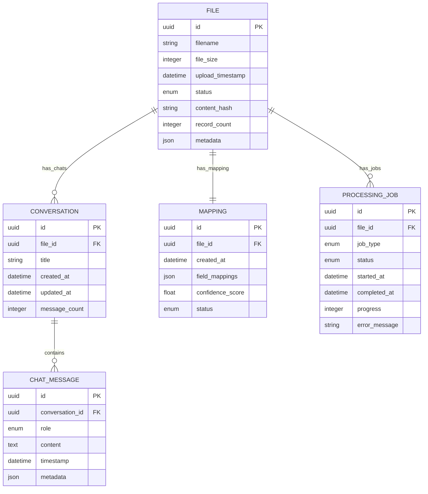

# EDI Healthcare Data Integration POC: Data Model

## POC Scope
This data model is simplified for POC demonstration focusing on:
- Single file type (SmithRx claims)
- Basic mapping generation 
- AI chat functionality
- 3-panel UI support

## Core Entities

### File
**Purpose**: Represents uploaded SmithRx claims files
**Attributes**:
- `id`: UUID - Primary key
- `filename`: String - Original filename
- `file_size`: Integer - Size in bytes
- `upload_timestamp`: DateTime - When uploaded
- `status`: Enum - (uploading, parsing, parsed, indexed, failed)
- `content_hash`: String - SHA-256 for integrity
- `record_count`: Integer - Number of claims in file
- `metadata`: JSON - File statistics (avg claim amount, date range, etc.)

**Relationships**:
- One File → Many Conversations (AI chat)
- One File → One Mapping (simplified for POC)

**State Transitions**:
- uploading → parsing → parsed → indexed → (ready for chat)
- Any state → failed (with error details)

### Mapping
**Purpose**: Field mappings between SmithRx format and VBA schema
**Attributes**:
- `id`: UUID - Primary key
- `file_id`: UUID - Foreign key to File
- `created_at`: DateTime - When generated
- `field_mappings`: JSON - Array of field mapping objects
- `confidence_score`: Float - Overall mapping confidence (0.0-1.0)
- `status`: Enum - (generating, draft, approved)

**Field Mapping Object Structure**:
```json
{
  "source_field": "CLAIM_AMT",
  "target_field": "claim_amount", 
  "confidence": 0.95,
  "transformation": "decimal",
  "manual_override": false
}
```

**Relationships**:
- One Mapping → One File

### Conversation
**Purpose**: AI chat sessions about uploaded files
**Attributes**:
- `id`: UUID - Primary key
- `file_id`: UUID - Foreign key to File
- `title`: String - Conversation title
- `created_at`: DateTime - When started
- `updated_at`: DateTime - Last message timestamp
- `message_count`: Integer - Total messages

**Relationships**:
- One Conversation → One File
- One Conversation → Many ChatMessages

### ChatMessage
**Purpose**: Individual messages in AI conversations
**Attributes**:
- `id`: UUID - Primary key
- `conversation_id`: UUID - Foreign key to Conversation
- `role`: Enum - (user, assistant, system)
- `content`: Text - Message content
- `timestamp`: DateTime - When sent
- `metadata`: JSON - Response time, tokens, sources

**Relationships**:
- Many ChatMessages → One Conversation

### ProcessingJob (Simplified)
**Purpose**: Track file processing and indexing jobs
**Attributes**:
- `id`: UUID - Primary key
- `file_id`: UUID - Foreign key to File
- `job_type`: Enum - (parse, index, map)
- `status`: Enum - (queued, running, completed, failed)
- `started_at`: DateTime - Job start time
- `completed_at`: DateTime - Job completion time
- `progress`: Integer - Progress percentage (0-100)
- `error_message`: String - Error details if failed

**Relationships**:
- Many ProcessingJobs → One File

## POC Database Schema

```sql
-- Files table
CREATE TABLE files (
    id UUID PRIMARY KEY DEFAULT gen_random_uuid(),
    filename VARCHAR(255) NOT NULL,
    file_size INTEGER NOT NULL,
    upload_timestamp TIMESTAMP DEFAULT CURRENT_TIMESTAMP,
    status VARCHAR(20) DEFAULT 'uploading',
    content_hash VARCHAR(64),
    record_count INTEGER,
    metadata JSONB
);

-- Mappings table
CREATE TABLE mappings (
    id UUID PRIMARY KEY DEFAULT gen_random_uuid(),
    file_id UUID REFERENCES files(id) ON DELETE CASCADE,
    created_at TIMESTAMP DEFAULT CURRENT_TIMESTAMP,
    field_mappings JSONB NOT NULL,
    confidence_score FLOAT DEFAULT 0.0,
    status VARCHAR(20) DEFAULT 'generating'
);

-- Conversations table
CREATE TABLE conversations (
    id UUID PRIMARY KEY DEFAULT gen_random_uuid(),
    file_id UUID REFERENCES files(id) ON DELETE CASCADE,
    title VARCHAR(255),
    created_at TIMESTAMP DEFAULT CURRENT_TIMESTAMP,
    updated_at TIMESTAMP DEFAULT CURRENT_TIMESTAMP,
    message_count INTEGER DEFAULT 0
);

-- Chat messages table
CREATE TABLE chat_messages (
    id UUID PRIMARY KEY DEFAULT gen_random_uuid(),
    conversation_id UUID REFERENCES conversations(id) ON DELETE CASCADE,
    role VARCHAR(20) NOT NULL,
    content TEXT NOT NULL,
    timestamp TIMESTAMP DEFAULT CURRENT_TIMESTAMP,
    metadata JSONB
);

-- Processing jobs table
CREATE TABLE processing_jobs (
    id UUID PRIMARY KEY DEFAULT gen_random_uuid(),
    file_id UUID REFERENCES files(id) ON DELETE CASCADE,
    job_type VARCHAR(20) NOT NULL,
    status VARCHAR(20) DEFAULT 'queued',
    started_at TIMESTAMP,
    completed_at TIMESTAMP,
    progress INTEGER DEFAULT 0,
    error_message TEXT
);

-- Indexes for performance
CREATE INDEX idx_files_status ON files(status);
CREATE INDEX idx_conversations_file_id ON conversations(file_id);
CREATE INDEX idx_chat_messages_conversation_id ON chat_messages(conversation_id);
CREATE INDEX idx_processing_jobs_file_id ON processing_jobs(file_id);
CREATE INDEX idx_processing_jobs_status ON processing_jobs(status);
```

## Data Relationships Diagram



## Sample Data for POC

### Sample File Record
```json
{
  "id": "file-123-456",
  "filename": "smithrx_claims_sample.txt",
  "file_size": 2048576,
  "status": "indexed",
  "record_count": 1247,
  "metadata": {
    "avg_claim_amount": 156.78,
    "date_range": {"start": "2025-01-01", "end": "2025-01-31"},
    "unique_members": 892,
    "total_claim_amount": 195503.66
  }
}
```

### Sample Mapping Record
```json
{
  "id": "mapping-789-012",
  "file_id": "file-123-456", 
  "confidence_score": 0.87,
  "status": "approved",
  "field_mappings": [
    {
      "source_field": "MEMBER_ID",
      "target_field": "member_id",
      "confidence": 0.99,
      "transformation": "string",
      "manual_override": false
    },
    {
      "source_field": "CLAIM_AMT",
      "target_field": "claim_amount",
      "confidence": 0.95,
      "transformation": "decimal(10,2)",
      "manual_override": false
    },
    {
      "source_field": "SVC_DATE",
      "target_field": "service_date", 
      "confidence": 0.88,
      "transformation": "date",
      "manual_override": true
    }
  ]
}
```

### Sample Chat Messages
```json
[
  {
    "role": "user",
    "content": "How many claims are in this file?",
    "timestamp": "2025-09-08T14:30:00Z"
  },
  {
    "role": "assistant", 
    "content": "This SmithRx claims file contains 1,247 claims from 892 unique members, covering the period from January 1-31, 2025. The total claim amount is $195,503.66.",
    "timestamp": "2025-09-08T14:30:03Z",
    "metadata": {
      "tokens_used": 45,
      "response_time_ms": 2100,
      "confidence_score": 0.95,
      "sources": ["file_metadata", "record_count_analysis"]
    }
  }
]
```

This simplified data model supports the POC's core functionality while maintaining a clear path to the full implementation.